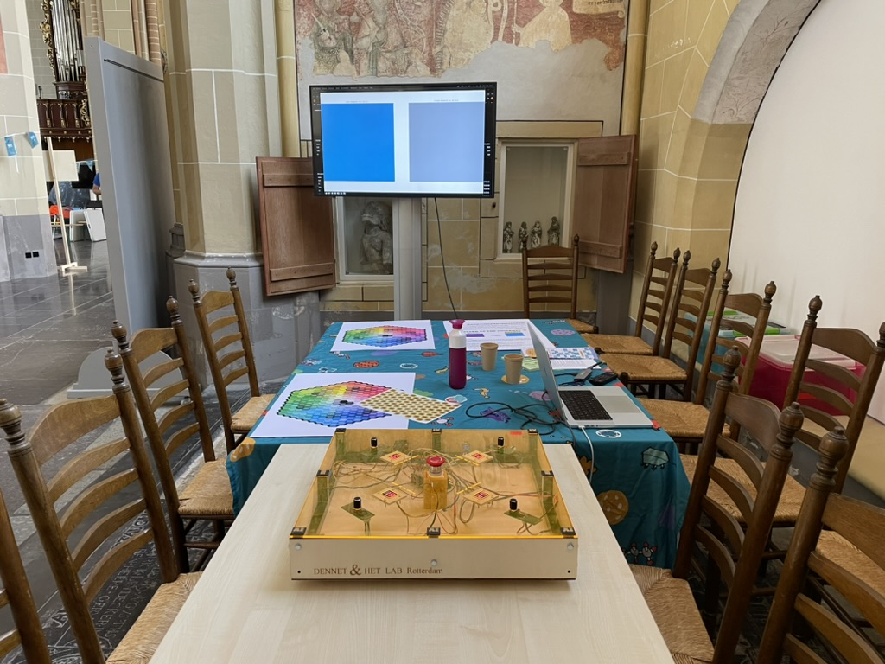

# AI Trainer

A 3 part project to allow young children to play a game. Basically they can turn knobs to influence a color and they have to try and reach to goal color. As quickly and closely as possible. 

The trainier was built for an expedition on [Expeditie Next on how to train AI](https://expeditienext.nl/activiteit/hoe-train-je-ai/). As the target group was children between 6 and 12, this is a gross simplification. The expedition took place in the 'Walburgiskerk' in Zutphen on the 1st of May 2024.

### Colors

In the Colors section you will find a Python program that reads from the Serial and plots both a Goal color and an Actual color. To run a database connection is required so that after each attempt the score can be registered. 

### Trainer 

In the trainer section you can find the firmware for the Trainer as a platformio project. As development was done under timeconstraints and a high number of pins required an Arduino Mega was used. 

### Database

In the database folder you can find the docker-compose.yaml to set up a database and the sql to create the table. 

# License 

Project is released under [GNU GPLv3.0 license](https://www.gnu.org/licenses/gpl-3.0.en.html). 

